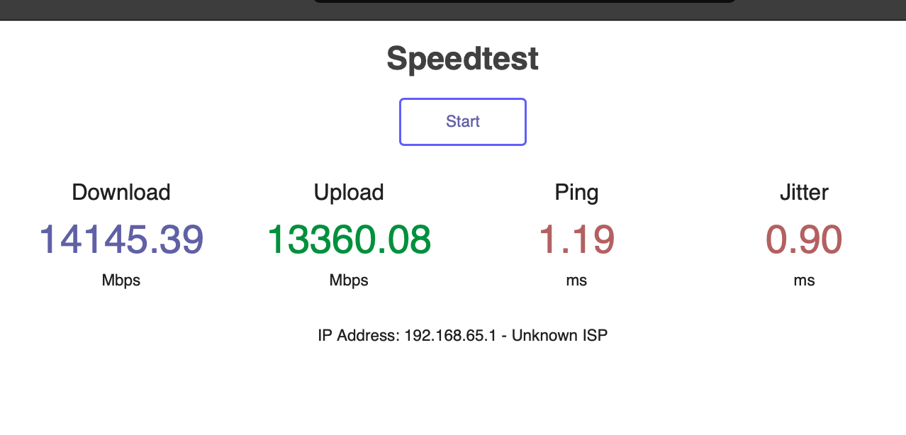

# FROM: LibreSpeed - speedtest

Lightweight speedtest implemented in Javascript and PHP.

## Screenshot Sample
<p align="center">



## GitHub Project Page 

https://github.com/librespeed/speedtest

## How-To 

```
## view/edit Dockerfile

## build image
docker build -t speedtest .

## run container
docker container run --name speedtest --detach --publish 8080:80 speedtest:latest

```

```
## access container
http://127.0.0.1:8080

```

```
## teardown container
docker container rm -f $(docker container ls -aq -f name=speedtest) 

## teardown image
docker image rm -f $(docker image ls -aq -f reference='speedtest*') 

```

